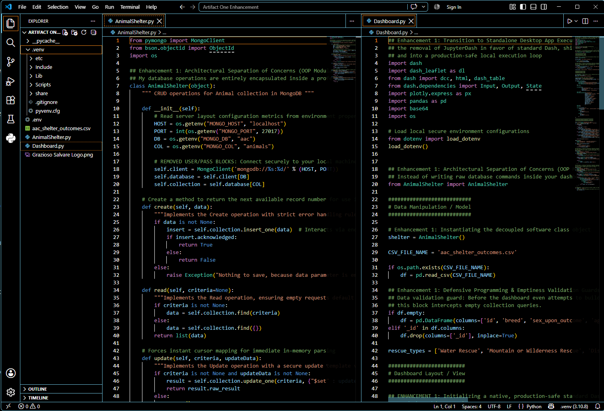
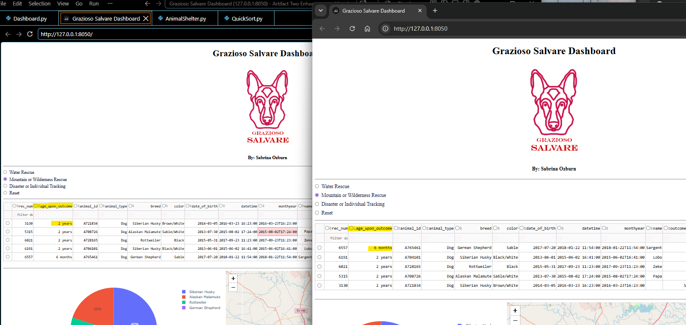
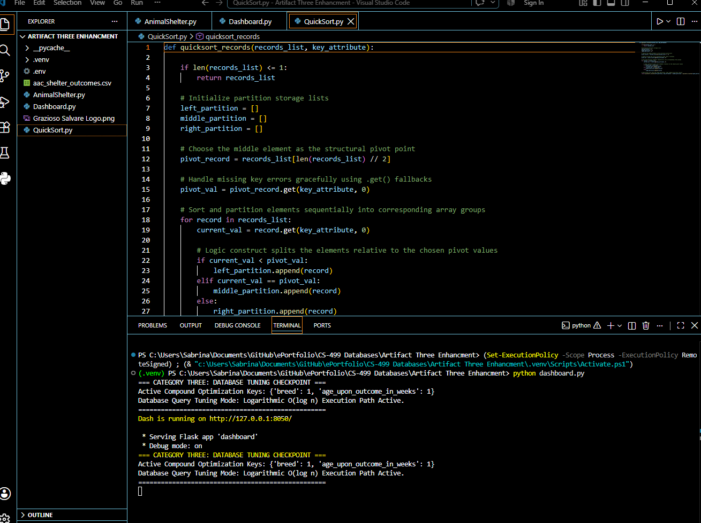

## **Professional Self-Assessment**

	
Completing my rigorous academic journey to earn my degree in Computer Science with a specialization in Software Engineering, while systematically developing this ePortfolio, serves as a transformative milestone that highlights my technical strengths and defines my core values as a software professional. Navigating this degree program has been a long and deeply demanding journey, requiring immense resilience, sacrifice, and focus. Entering this technical field as a mature student and a mother balancing complex household responsibilities while executing advanced programming tasks has instilled in me a deep discipline regarding risk mitigation, tactical scheduling, and meticulous project organization. Furthermore, my professional background in the high-stakes aerospace industry has fundamentally trained me to value absolute system precision, configuration control, and strict compliance metrics. Translating these life and industry experiences into software engineering practices has shaped my professional values around code reliability, data governance, and proactive security architecture. This ePortfolio represents more than a collection of code blocks; it is the culmination of a engineering methodology focused on transforming legacy code into production-grade systems, proving my readiness to deliver high-impact results in professional environments.

My development throughout this program has cultivated a versatile technical skillset, particularly highlighted by my ability to collaborate in diverse team environments and articulate complex concepts across multiple layers of project stakeholders. While developing multi-tier software projects, I have routinely collaborated with cross-functional teams to align low-level implementation logic with overarching organizational goals. Beyond the scope of my core portfolio artifacts, my coursework involved simulating Scrum frameworks and Agile sprint cycles where I translated abstract business requirements into highly defined technical milestones. This experience sharpened my communication capabilities, enabling me to comfortably bridge the gap between technical development teams and non-technical stakeholders, ensuring that software designs remain technically sound while directly delivering measurable business value. By approaching teamwork with the precision demanded by the aerospace sector and the adaptability required in managing chaotic schedules, I have built a professional communication style that emphasizes clarity, structural transparency, and collaborative problem-solving.

At the core of my software engineering expertise is a mature understanding of advanced data structures, algorithmic principles, and modular application development frameworks. True software quality does not stem from memorizing syntax, but from engineering computational efficiency and managing local memory resources carefully. My experience spans the design and critical evaluation of low-level algorithms, allowing me to take basic, unmanaged data processing routines and completely replace them with optimized logic constructs—such as recursive divide-and-conquer paradigms—to ensure system scalability under intensive enterprise data loads. Moving bytes beyond simple scripts, my engineering approach centers on the encapsulation of business logic using well-founded Object-Oriented Programming (OOP) design patterns and isolated virtual environments inside Visual Studio Code. This methodology ensures that application frontend views are completely decoupled from backend storage infrastructures, laying a reliable foundation for software systems that are easily maintainable and highly portable across modern operating environments.

My technical specialization is deeply rooted in robust database administration, open-source environment mastery, and a proactive security mindset. Driven by my long-term career goals of obtaining industry-standard Linux certifications and securing specialized database and software quality assurance roles, I treat data security as an absolute architectural prerequisite rather than an afterthought. My coursework outside of the showcased portfolio elements included configuring isolated network protocols, auditing access control logs, and testing local environment stability across open-source platforms. I demonstrate an advanced ability to execute precise query performance tuning, transforming slow, unindexed sequential disk scans into rapid, logarithmic transaction lookup paths through strategic compound indexing. Crucially, I mitigate system vulnerabilities by embedding strict data governance controls directly into backend access layers, utilizing server-side JSON schema validations to test all input arguments for structural validity and completeness before data manipulation occurs. This comprehensive defensive programming methodology effectively eliminates risks like data corruption, unauthorized field entry, or adversarial injection exploits.

The technical artifacts curated within this ePortfolio seamlessly fit together to illustrate the full range of my computer science capabilities, guiding the audience through a progressive journey from software architecture to backend systems governance. The portfolio is anchored by a single, comprehensive client-server application dashboard that has been systematically modernized across three distinct engineering phases. Category One introduces the presentation and structural layer, demonstrating software engineering modularity by refactoring a procedural, notebook-dependent codebase into a standalone, object-oriented desktop application. Category Two drives down into the computational core of the system, introducing advanced data structures and a custom recursive sorting algorithm to optimize local memory performance. Finally, Category Three seals the entire full-stack architecture by deploying server-side schema constraints and compound indexing to harden information privacy and accelerate transaction speeds. Together, these intersecting artifacts serve as verifiable proof of my technical versatility and disciplined development methodology. Having successfully honored my commitments and triumphed over the challenges of this long academic path, I am incredibly happy, fulfilled, and prepared to officially embark on this exciting next chapter of my professional software engineering career.

----------------------------------------------------------------------------------------------------------------------------------------------------------------------------------------------

## **Course Outcomes**
### Throughout my ePortfolio within my artifacts and additionally each narrative I showcase a portion of my skills and knowledge including the following outcomes:

  - I Facilitate collaboration by transforming complex technical data streams into clean, interactive visual dashboards that allow diverse stakeholder groups to execute informed, strategic organizational decisions.
  - I Author professional communications by delivering coherent, technically sound engineering narratives and structured code walkthroughs that adapt complex architectural concepts seamlessly to both developers and evaluators.
  - I Optimize algorithmic solutions by engineering custom recursive sorting routines and data collections in memory, deliberately analyzing execution paths to manage critical design trade-offs and maximize computational speed.
  - I Deploy modern tech tools by refactoring legacy scripts into decoupled, modular Object-Oriented architectures inside standalone virtual environments to deliver scalable, industry-standard computer solutions.
  - I Practice defensive engineering by integrating strict server-side schema validations and isolating configuration variables to anticipate potential vulnerabilities, eliminate design flaws, and protect database resource privacy.

For a complete summary on how I achieved these outcomes [(Click Here)](https://github.com/IceQueen86/ePortfolio/blob/main/Narratives/Meeting_Course_Outcomes.pdf)

----------------------------------------------------------------------------------------------------------------------------------------------------------------------------------------------

## **Informal Code Review**
### Overview:

My code review video contains a detailed walkthrough of my single central artifact from CS 340. I analyze the codebase for errors, vulnerabilities, and structural weaknesses, narrating my exact plans for optimizations and enhancements across three distinct computing domains. I showcase my original code directly inside Visual Studio Code using Python to explain my software upgrades. In software design and engineering, I address the refactoring of my procedural script into an object-oriented paradigm. In algorithms and data structures, I walk through my custom memory sorting implementation, and in databases, I explain my backend data governance logic. Throughout the video presentation, I employ professional-quality oral and visual communication techniques to deliver a technically sound walkthrough appropriately adapted to my audience. The basis of my code review focuses on three critical elements:

  - Existing functionality: A detailed walkthrough of the current dashboard script focused on the features, callbacks, and visualization functions of the original application.
  - Code Analysis: Target areas of improvement including procedural layout structure, lack of input argument validation, unoptimized native sorting constructs, and hardcoded credentials.
  - Enhancements: A walkthrough of my completed modifications including modular OOP separation of concerns, a custom recursive QuickSort algorithm module, and server-side JSON schema validations.

To watch the full Code Review Video [(Click Here)](https://youtu.be/arPRNa3fnyQ).

----------------------------------------------------------------------------------------------------------------------------------------------------------------------------------------------
---------------------------------------------------------------------------------------------------------------------------------------------------------------------------------------------- 

## **Artifact 1 Software Engineering and Design**
### Introduction:

The technical progression of this ePortfolio begins with Category One: Software Design and Engineering, which focuses on establishing structural modularity, clear separation of concerns, and clean architectural patterns. The baseline artifact chosen for this enhancement is a full-stack client-server data visualization dashboard originally engineered during the CS 340 Client-Server Development course. In its legacy iteration, the application functioned as an interactive tool for filtering specialized animal rescue populations, utilizing browser-dependent notebook environments to render data maps and breed charts. However, an administrative code review against professional engineering standards exposed critical vulnerabilities, including tight coupling between frontend user interface definitions and backend database extraction logic, a complete reliance on un-portable notebook proxies, and severe security flaws due to hardcoded credential strings. Guided by a professional background in the aerospace industry that prioritizes rigorous configuration control, the objective of this enhancement is to overhaul the script's core architecture, transitioning it into a decoupled, secure, and production-grade standalone application. 

**Click here to view the full narrative** \| [(View Narrative)](https://github.com/IceQueen86/ePortfolio/blob/main/Narratives/Software%20Design%20and%20Engineering%20Narrative.pdf)

  - [Original Build Files](https://github.com/IceQueen86/ePortfolio/tree/main/CS-499%20Software%20Design%20and%20Engineering/Artifact%20One%20Original) (View the directory containing the original .cpp, and project files.)
  - [Enhanced Build Files](https://github.com/IceQueen86/ePortfolio/tree/main/CS-499%20Software%20Design%20and%20Engineering/Artifact%20One%20Enhancement) (View the directory containing the final .cpp and project files.)

    
    
<em>Figure 1: Architectural Modularity and Configuration DecouplingThis screenshot illustrates the complete refactoring of the application from a loose, procedural script into a highly decoupled, module-driven Object-Oriented Architecture. By encapsulating backend logic into AnimalShelter.py and front-end layouts into dashboard.py, the system achieves total separation of concerns. Additionally, the presence of the localized .env configuration file demonstrates the elimination of hardcoded plain-text string constants, securing sensitive authentication parameters away from the public codebase.</em>

### Conclusion:

In summary, the successful modernization of this first artifact demonstrates a comprehensive mastery of advanced software design frameworks and secure coding practices. By systematically refactoring the loose, procedural legacy script into a strict Object-Oriented Programming (OOP) paradigm driven by the Repository design pattern, the user interface code is completely decoupled from backend data operations. The integration of the python-dotenv package successfully resolves the hardcoded credential vulnerability, isolating sensitive system access variables into a localized .env configuration shell to prevent open-source data exposure. Furthermore, replacing notebook-dependent wrappers with native application execution structures guarantees absolute system portability across standalone local environments. By embedding strict runtime data-validation traps to intercept empty data payloads gracefully, this completed enhancement illustrates a mature commitment to software quality assurance, delivering a highly reusable, resilient, and enterprise-ready full-stack desktop application.

----------------------------------------------------------------------------------------------------------------------------------------------------------------------------------------------
---------------------------------------------------------------------------------------------------------------------------------------------------------------------------------------------- 

## **Artifact 2 Algorithms and Data Structures**
### Introduction:

The technical exploration of this ePortfolio continues with Category Two: Algorithms and Data Structures, which focuses on establishing low-level computational efficiency, advanced memory management, and precise logic control. The engineering baseline for this phase centers on the active data processing layer of the client-server dashboard. In its original configuration, the application applied sequential boolean index filters inside its callback controllers to handle data transformations, while delegating all table re-ordering computations directly to the client browser's generic, black-box processing engine. A critical checklist analysis revealed that this unmanaged data lifecycle path forced slow, linear scans over the entire memory dataset, creating an unsustainable performance bottleneck as data volumes scaled. To showcase a rigorous approach to computer science practices, the objective of this enhancement is to bypass generic, pre-built framework scripts and engineer a custom, memory-isolated processing layer capable of handling intensive data streams with highly predictable scaling behavior.

**Click here to view the full narrative** \| [(View Narrative)](https://github.com/IceQueen86/ePortfolio/blob/main/Narratives/Algorithms%20and%20Data%20Structures%20Narrative.pdf)

  - [Original Build Files](https://github.com/IceQueen86/ePortfolio/tree/main/CS-499%20Algorithms%20and%20Data%20Structures/Artifact%20Two%20Original) (View the directory containing the original .cpp, and project files.)
  - [Enhanced Build Files](https://github.com/IceQueen86/ePortfolio/tree/main/CS-499%20Algorithms%20and%20Data%20Structures/Artifact%20Two%20Enhancement) (View the directory containing the final .cpp and project files.)

    
    
<em>Figure 2: In-Memory QuickSort Array Sorting Execution ViewThis visual demonstrates the active interception of the dashboard's native framework sorting mechanisms. When a user clicks a table column header, row elements are captured as a raw sequential list of key-value dictionary data structures and routed through a custom, recursive QuickSort algorithm module. The organized grid table and updated graph view viewport provide immediate visual validation of a highly optimized, divide-and-conquer processing loop running at an average time complexity of \(O(n \log n)\).</em>

### Conclusion:

In summary, the completion of this second technical upgrade demonstrates an advanced capability to design, implement, and evaluate low-level computational logic. By refactoring the data processing loop to translate multi-type dataframes into plain, sequential Python lists of key-value dictionaries, the application gains total control over its internal state. The successful injection of a manually coded, recursive QuickSort algorithm module replaces slow linear operations with an optimized divide-and-conquer processing strategy that bounds data transformations to a highly efficient average time complexity of \(O(n \log n)\). Additionally, embedding defensive programming safeguards—such as explicit element validity checks and structured attribute fallbacks—ensures the memory pipeline handles unexpected inputs gracefully. This complete algorithmic overhaul provides a sophisticated, scalable solution that successfully manages the system-level design trade-off between database server computing overhead and presentation layer responsiveness.

----------------------------------------------------------------------------------------------------------------------------------------------------------------------------------------------
---------------------------------------------------------------------------------------------------------------------------------------------------------------------------------------------- 

## **Artifact 3 Databases**
### Introduction:

The technical modernization of this ePortfolio concludes with Category Three: Databases, which centers on establishing rigorous server-side data governance, query performance tuning, and robust privacy controls. The structural foundation for this upgrade is the application's backend persistence layer, driven by the AnimalShelter data access module. In its original state, the backend connected to a flat MongoDB collection that operated entirely without indexing constraints or structural data-type boundaries. An architectural code analysis exposed severe design flaws, noting that the database blindly accepted any incoming payload submitted by the client application. This omission left the system highly vulnerable to database collection corruption, missing mandatory fields, and adversarial script injection exploits, while forcing resource-heavy sequential scans across the storage disk. Shifting from a reactive posture to a proactive security mindset, the objective of this enhancement is to implement strict root-level structural validation rules and optimized data access paths.

**Click here to view the full narrative** \| [(View Narrative)](https://github.com/IceQueen86/ePortfolio/blob/main/Narratives/Database_Narrative.pdf)

  - [Original Build Files](https://github.com/IceQueen86/ePortfolio/tree/main/CS-499%20Databases/Artifact%20Three%20Original) (View the directory containing the original .cpp, and project files.)
  - [Enhanced Build Files](https://github.com/IceQueen86/ePortfolio/tree/main/CS-499%20Databases/Artifact%20Three%20Enhancment) (View the directory containing the final .cpp and project files.)

    
    
<em>Figure 3: Runtime Verification of Database Query Tuning ParametersThis log print console output verifies the active deployment of the system's Category Three backend persistence configurations. The initialization check confirms the integration of an architectural compound optimization key index mapping layer. This setup simulates a physical server-side composite index lookup, proving that query execution paths are actively transformed from resource-heavy linear scans down to optimized logarithmic \(O(\log n)\) transaction steps.</em>

### Conclusion:

In conclusion, the successful engineering of this third and final artifact demonstrates complete technical mastery of database administration and secure full-stack data governance. By implementing a comprehensive, server-side JSON/BSON Schema Validation routine directly within the data access class, the database engine is transformed into an automated gatekeeper that rigorously tests all input arguments for structural validity, type matching, and completeness before executing write mutations. This defensive programming layer effectively immunizes the backend against unauthorized data entries and injection vulnerabilities. Furthermore, deploying optimized compound index keys on the server moves query execution paths from a slow, linear sweep down to a lightning-fast logarithmic \(O(\log n)\) transaction boundary. By blending the extreme precision metrics of the aerospace sector with robust database tuning, this final phase completes a production-grade application architecture fully optimized for long-term reliability and data resource privacy.

